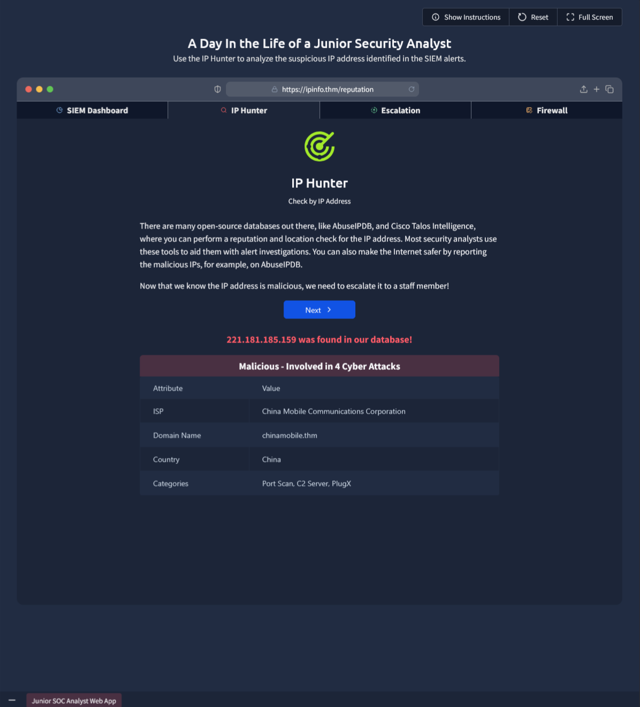

# Junior Security Analyst Intro

## Overview

This room simulated one of the day-to-day responsibilities of a Tier 1 SOC Analyst. The scenario involved monitoring a SIEM dashboard, identifying suspicious alerts, performing OSINT on malicious IPs and escalating alerts to a senior analyst.

---

## Scenario

### Alert Triage

Two critical alerts appeared on the dashboard originating from the same IP address:
- Unauthorized login attempts from IP address 221.181.185.159 to port 22
- Successful SSH login from the suspicious IP address 221.181.185.159

**Suspicious IP:** `221.181.185.159`

### OSINT - IP Hunter Lookup

Searched the IP in the **IP Hunter** threat intelligence database. Results:

  

### Actions Taken

1. Identified the IP as **malicious** based on threat intel
2. Escalated to SOC Team Lead **Will Griffin** with the IP and context
3. Blocked the IP
4. Documented verdict: *Brute-forced SSH*

---

## Skills Demonstrated

- Alert monitoring from a SOC dashboard
- IP reputation lookup using threat intelligence tools
- Escalation procedure to senior analyst
- Documenting findings and applying defensive action

