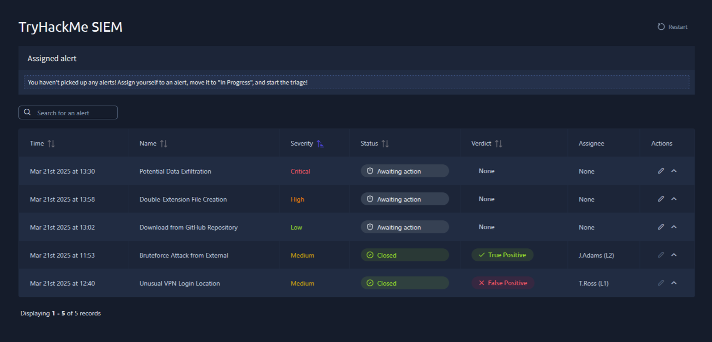
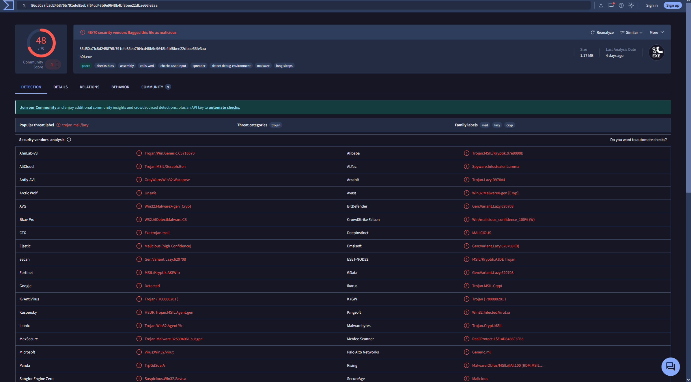

# SOC L1 Alert Triage

## About This Room

> *Learn more about SOC alerts and build a systematic approach to efficiently triaging them.*

**Learning Objectives:**
- Familiarise with the concept of SOC alerts
- Explore alert fields, statuses, and classifications
- Learn how to perform alert triage as an L1 analyst
- Practice with real alerts and SOC workflows

---

## Overview

This room simulated a real SOC alert triage. The room involved monitoring a SIEM dashboard, determining prioritisation logic, how to distinguish True Positives from False Positive and how to correctly assign and status alerts.

---

## Triage Principles Practised

- Prioritise **medium before low** severity alerts
- Work **oldest alerts first**
- Self-assign alerts before investigating
- Change status to **In Progress** when starting work

---

## Dashboard - Alert Queue

The dashboard contained 5 alerts. I triaged the top 3 by priority:

  

---

## Alert 1 - Potential Data Exfiltration

| Field | Value |
|---|---|
| **Severity** | Critical |
| **Description:** | This rule detects 5 or more gigabytes of data sent from a single device to a single destination within a day, which may indicate data exfiltration to untrusted location. |
| **Destination** | *.zoom.us |
| **Source IP** | 192.168.45.66 |
| **Source Network** | UK04/MEETINGROOM |
| **Sent Data** | 5.8 GB |
| **Received Data** | 5.2 GB |
| **Verdict** | False Positive |

**Analysis:** 

---

## Alert 2 - Double-Extension File Creation

| Field | Value |
|---|---|
| **Severity** | High |
| **Description** | This rule detects a creation of a double-extension file like '*.pdf.exe' or '*.gif.lnk', often used by hackers in phishing attacks to trick users into opening the malicious executable. |
| **Host** | LPT-HR-009 |
| **Process Name** | chrome.exe |
| **Process User** | S.Conway |
| **Target File** | C:\Users\S.Conway\Downloads\cats2025.mp4.exe |
| **Source URL** | https://freecatvideoshd[.]monster/cats2025[.]mp4[.]exe |
| **File MD5** | 14d8486f3f63875ef93cfd240c5dc10b |
| **VirusTotal** | 48/70 detections |
| **Verdict** | True Positive |

**Analysis:**  

  

---

## Alert 3 - Download from GitHub Repository

| Field | Value |
|---|---|
| **Severity** | Low |
| **Description** | This rule detects any download from GitHub. While GitHub stores lots of great projects that our IT team uses, it also stores malicious scripts and exploits that must not be downloaded by the users. |
| **Accessed URL** | https://github.com/facebook/react |
| **Source User** | G.Chandler |
| **Source Host** | LPT-IT-063 |
| **Source Network** | VPN/DEVELOPERS |
| **Verdict** | False Positive |

**Analysis:**  

---

## Skills Demonstrated

- Alert prioritisation by severity and age
- True Positive vs False Positive determination
- IOC enrichment (VirusTotal hash lookup)
- Contextual analysis (network segment, user role, traffic ratios)
- Writing concise analyst comments

---

## Lessons Learned

- Context is everything when triaging alerts - the same activity can be benign or malicious depending on who did it, from where and why

